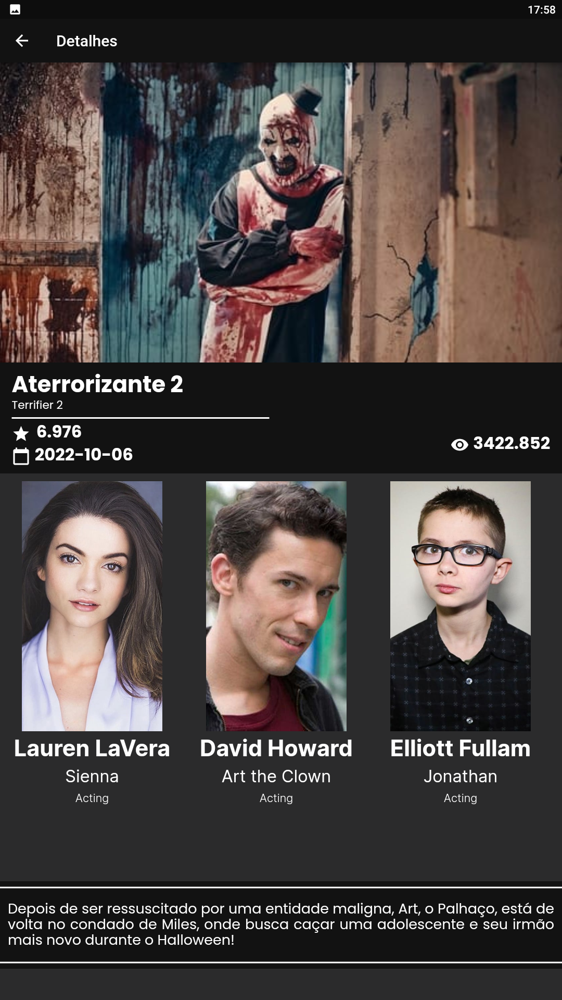

# filmes_em_cartaz

Uma Aplicação Flutter que consome uma Api chamada The Movie DB.

## Como iniciar o projeto?

Para o Desenvolvimento desta aplicação, foi utilizado uma ferramenta chamada Flutter. Flutter é um
Framework de desenvolvimento de aplicativos móveis, criado pelo Google, que permite a criação de
aplicativos compilados nativamente para Android e iOS a partir de um único código base.
Para instalar essa ferramenta, siga os paços descritos no site [oficial do Flutter](https://flutter.dev/docs/get-started/install).

## Como rodar o projeto?

Antes de rodar o projeto, é necessário instalar as dependências do projeto. Para isso, execute o
comando abaixo:

```bash
flutter pub get
```

Logo após a instalação das dependências, é necessário que seja criada uma conta no
site [The Movie DB](https://www.themoviedb.org/), para que seja gerado uma chave de acesso a API;
Com a chave em mãos, coloque-a na variável token no
arquivo [Filme_service](lib/src/services/filme_service.dart).

Após seguir os passos acima, basta executar o comando abaixo para rodar o projeto:

```bash
flutter run
```

Selecione a plataforma que deseja rodar o projeto e aguarde o carregamento.

## Visual do aplicativo

<div style='display:flex;'>
    <article>
        
        <p>Tela Home</p>
    </article>
    <article>
        
        <p>Tela Detalhes</p>
    </article>
    <article>
        
        <p>Tela Pesquisa</p>
    </article>
</div>
<hr>
## Contatos

- [Linkedin](https://www.linkedin.com/in/nayron-moura)
- [Github](https://www.github.com/nayronmoura)
- [Instagram](https://www.instagram.com/nayronmoura)
